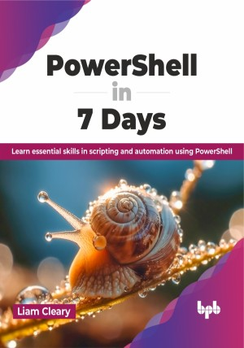

# PowerShell in 7 Days

Unlock the power of automation: Master PowerShell in just 7 days

This is the repository for [PowerShell in 7 Days
](https://bpbonline.com/products/powershell-in-7-days),published by BPB Publications.

## About the Book
"PowerShell in 7 Days" covers the fundamentals of PowerShell, its syntax, and its scripting capabilities concisely yet comprehensively. It is a practical toolkit that empowers busy IT professionals to become proficient PowerShell users. You can become capable of automating tasks and managing systems more efficiently within a week. 

Examine its history, versions, and various use cases before examining installation options for different platforms. Master modules, providers, commands, and pipelines to craft efficient scripts. Build reusable functions, control script flow with looping and error handling, and create scripts with diverse outputs. Use PowerShell remoting to manage systems remotely. Manage on-premises services like Active Directory and optimize performance by troubleshooting common issues. Finally, explore advanced functionalities like security best practices and signing scripts for confident use. 

By the end of the book, readers will have a solid understanding of working with both local and remote data, troubleshooting common issues using PowerShell, and writing scripts that save time and enhance productivity. Readers can transform their approach to tasks and challenges in their job roles, optimizing processes and deploying solutions quickly and effectively.

## What You Will Learn
• Master the basics of PowerShell syntax and command execution.

• Develop custom scripts for automation and system tasks.

• Efficiently manage and manipulate both local and remote data.

• Apply PowerShell for effective troubleshooting and problem-solving in real-world scenarios.

• Create advanced functions to streamline daily IT operations.
